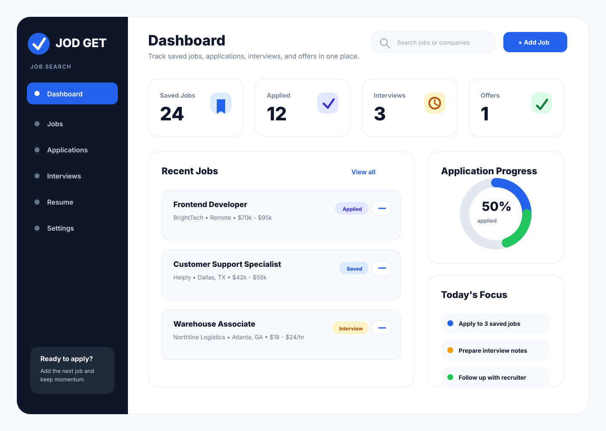

# JOD GET Figma Model Plan

## Product summary

**JOD GET** is a job search management app for people who want help finding jobs, saving opportunities, and tracking every job application in one place.

The first Figma model should show a clean web app MVP that can later become a full-stack application.

## Design direction

- **Style:** Clean, modern, professional, easy to read.
- **Platform:** Desktop web first, then mobile responsive.
- **Mood:** Helpful, confident, organized, career-focused.
- **Primary users:** Job seekers, career changers, and people applying to many jobs.

## Figma file setup

Create a Figma file named:

```text
JOD GET - Job Search App MVP
```

Create these pages in Figma:

1. `Cover`
2. `Design System`
3. `Desktop Wireframes`
4. `Mobile Wireframes`
5. `Prototype Flow`

## Frame sizes

Use these frame sizes:

| Device | Size |
| --- | --- |
| Desktop | 1440 × 1024 |
| Tablet | 834 × 1194 |
| Mobile | 390 × 844 |

## Color palette

| Token | Color | Usage |
| --- | --- | --- |
| Primary Blue | `#2563EB` | Main buttons, active navigation, links |
| Deep Navy | `#0F172A` | Headings and sidebar background |
| Soft Gray | `#F8FAFC` | App background |
| Border Gray | `#E2E8F0` | Card borders and dividers |
| Text Gray | `#64748B` | Secondary text |
| Success Green | `#22C55E` | Offers, successful actions |
| Warning Amber | `#F59E0B` | Interviews and pending reminders |
| Error Red | `#EF4444` | Rejections or destructive actions |
| White | `#FFFFFF` | Cards and content surfaces |

## Typography

Use the **Inter** font family.

| Style | Size | Weight | Usage |
| --- | --- | --- | --- |
| Display | 48px | 700 | Landing page hero heading |
| H1 | 32px | 700 | Page titles |
| H2 | 24px | 700 | Section titles |
| H3 | 18px | 600 | Card titles |
| Body | 16px | 400 | Main text |
| Small | 14px | 400 | Labels and metadata |
| Caption | 12px | 500 | Status badges |

## Core components

### Button

Create button variants:

1. **Primary**
   - Fill: `#2563EB`
   - Text: white
   - Radius: 10px
   - Height: 44px
   - Padding: 16px horizontal

2. **Secondary**
   - Fill: white
   - Border: `#E2E8F0`
   - Text: `#0F172A`
   - Radius: 10px
   - Height: 44px

3. **Danger**
   - Fill: `#EF4444`
   - Text: white
   - Radius: 10px
   - Height: 44px

### Job card

Each job card should include:

- Job title
- Company name
- Location
- Salary range
- Job source or link
- Status badge
- `View Details` button
- `Apply` button

Card styling:

- Fill: white
- Border: `#E2E8F0`
- Radius: 16px
- Padding: 20px
- Gap: 12px

### Status badges

| Status | Background | Text |
| --- | --- | --- |
| Saved | `#DBEAFE` | `#1D4ED8` |
| Applied | `#E0E7FF` | `#4338CA` |
| Interview | `#FEF3C7` | `#B45309` |
| Offer | `#DCFCE7` | `#15803D` |
| Rejected | `#FEE2E2` | `#B91C1C` |


## Visual preview

Use this SVG preview to see the first desktop dashboard model before rebuilding it in Figma:



The preview shows the intended desktop dashboard layout with a dark sidebar, top search/action area, job-search stat cards, recent job cards, application progress, and daily focus tasks.

## Desktop screens

### 1. Landing page

**Purpose:** Introduce the app and encourage users to start managing their job search.

Frame name:

```text
Desktop / Landing Page
```

Layout:

- Top navigation bar
  - Left: `JOD GET` logo text
  - Center/right links: `Features`, `Dashboard`, `Pricing`, `Sign In`
  - Right button: `Get Started`
- Hero section
  - Heading: `Find jobs. Track applications. Get hired.`
  - Subheading: `JOD GET helps you save job opportunities, organize applications, and stay focused until you land the right role.`
  - Primary button: `Start Tracking Jobs`
  - Secondary button: `View Demo`
- Hero preview card
  - Mini dashboard with stat cards and job cards
- Feature section with three cards
  - `Save jobs fast`
  - `Track every application`
  - `Prepare for interviews`

### 2. Dashboard

**Purpose:** Give users a clear view of job search progress.

Frame name:

```text
Desktop / Dashboard
```

Layout:

- Left sidebar, width 260px
  - Logo: `JOD GET`
  - Navigation:
    - `Dashboard`
    - `Jobs`
    - `Applications`
    - `Interviews`
    - `Resume`
    - `Settings`
- Main content area
  - Header:
    - Page title: `Dashboard`
    - Search input: `Search jobs or companies`
    - Button: `Add Job`
  - Stat cards row:
    - `Saved Jobs` — `24`
    - `Applied` — `12`
    - `Interviews` — `3`
    - `Offers` — `1`
  - Two-column section:
    - Left: `Recent Jobs`
    - Right: `Application Progress`
  - Recent jobs list:
    - `Frontend Developer` at `BrightTech`
    - `Customer Support Specialist` at `Helply`
    - `Warehouse Associate` at `Northline Logistics`

### 3. Jobs list

**Purpose:** Show all saved jobs and allow filtering.

Frame name:

```text
Desktop / Jobs List
```

Layout:

- Sidebar same as dashboard
- Header:
  - Title: `Jobs`
  - Button: `Add Job`
- Filter bar:
  - Search input
  - Status dropdown
  - Location dropdown
  - Salary dropdown
- Job card grid or list
  - Cards should show title, company, location, salary, date saved, and status.

### 4. Add job form

**Purpose:** Let users manually save a job.

Frame name:

```text
Desktop / Add Job
```

Form fields:

- Job title
- Company
- Location
- Salary range
- Job link
- Source
- Status
- Notes

Buttons:

- `Cancel`
- `Save Job`

### 5. Job details

**Purpose:** Show one job and let the user update the application process.

Frame name:

```text
Desktop / Job Details
```

Sections:

- Job header:
  - Title
  - Company
  - Location
  - Status badge
- Action buttons:
  - `Open Job Link`
  - `Mark as Applied`
  - `Edit`
- Details card:
  - Salary
  - Source
  - Date saved
  - Application deadline
- Notes card
- Timeline card:
  - `Saved`
  - `Applied`
  - `Interview Scheduled`
  - `Offer`

### 6. Settings/Profile

**Purpose:** Let users manage personal details and preferences.

Frame name:

```text
Desktop / Settings
```

Sections:

- Profile information
  - Full name
  - Email
  - Phone
- Job preferences
  - Desired role
  - Preferred location
  - Remote preference
  - Minimum salary
- Resume section
  - Upload resume button

## Mobile screens

Create mobile versions for:

1. `Mobile / Landing Page`
2. `Mobile / Dashboard`
3. `Mobile / Jobs List`
4. `Mobile / Add Job`
5. `Mobile / Job Details`

Mobile layout guidance:

- Use bottom navigation instead of sidebar.
- Keep one column only.
- Job cards should stack vertically.
- Primary action button should be full width.
- Use a sticky bottom navigation with:
  - `Home`
  - `Jobs`
  - `Add`
  - `Profile`

## Prototype flow

Connect these screens in Figma prototype mode:

1. `Landing Page` → `Dashboard`
   - Trigger: click `Start Tracking Jobs`
2. `Dashboard` → `Jobs List`
   - Trigger: click `Jobs` in sidebar
3. `Jobs List` → `Add Job`
   - Trigger: click `Add Job`
4. `Add Job` → `Job Details`
   - Trigger: click `Save Job`
5. `Jobs List` → `Job Details`
   - Trigger: click any `View Details` button
6. `Job Details` → `Jobs List`
   - Trigger: click back navigation

## Sample data for mockups

Use these jobs in the wireframes:

| Job title | Company | Location | Salary | Status |
| --- | --- | --- | --- | --- |
| Frontend Developer | BrightTech | Remote | `$70k - $95k` | Applied |
| Customer Support Specialist | Helply | Dallas, TX | `$42k - $55k` | Saved |
| Warehouse Associate | Northline Logistics | Atlanta, GA | `$18 - $24/hr` | Interview |
| Junior Data Analyst | ClearMetric | Remote | `$58k - $72k` | Saved |
| Sales Representative | GrowthHub | Miami, FL | `$50k + commission` | Offer |

## Cover page content

Use this text on the Figma cover page:

```text
JOD GET
Job Search App MVP

A clean app concept for finding jobs, saving opportunities, tracking applications, and getting hired faster.
```

## Recommended first Figma build order

1. Create the design system page.
2. Build the desktop dashboard.
3. Build the jobs list.
4. Build the add job form.
5. Build the job details page.
6. Build the landing page.
7. Create mobile versions.
8. Connect the prototype flow.
